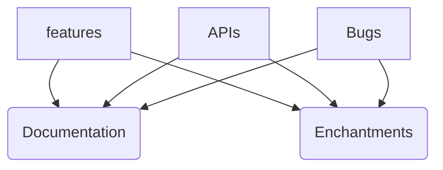

# OneIndexT

> WIP
 - READMEs and documentations are currently working hot in progress, minor bug fixings and feature achievements are necessary by far, the following priority graph represents a sequence on what I/we will accomplish in ordder.

